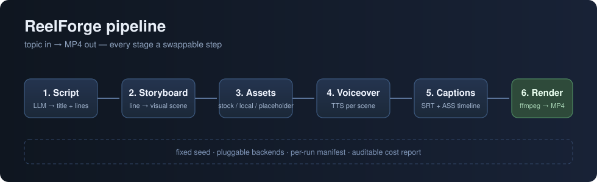

# ReelForge

> Topic in, MP4 out — deterministically.

ReelForge is an open-source, **deterministic-first** AI short-video generation engine. Give it a topic, it runs a six-stage pipeline — **script → storyboard → assets → voiceover → captions → render** — and produces a ready-to-publish MP4. Every stage is a swappable step and every backend is pluggable, so you get reproducible output, batch-friendly consistency, and auditable cost.

Unlike one-shot "topic-to-video" black boxes, ReelForge is built for people who need **control**: content teams, educators, indie creators, and marketers who produce video in volume with a consistent style.



## Why ReelForge?

Most AI-video tools are impressive demos that fall apart in production:

- **No reproducibility** — run the same topic twice, get a different video every time.
- **Vendor lock-in** — script, voice, and visuals are hardwired to one cloud provider.
- **No batch story** — you can't produce 20 videos in a consistent style.
- **Invisible cost** — you only find out what a run cost after the invoice.

ReelForge answers each one:

| Pain point | ReelForge solution |
| --- | --- |
| Unstable output | Fixed seed + full manifest of every run; same topic ⇒ same pipeline, same artifacts |
| Vendor lock-in | Pluggable backends for LLM (OpenAI-compatible / offline), TTS, and assets |
| No batch workflow | One config, N topics; identical stage wiring across a batch |
| Hidden cost | A per-run `cost-report.json` breaks down tokens, calls and estimated USD per stage |

## Pipeline

```
topic
  │
  ▼
[1] Script        LLM writes a short spoken script (title + lines)
  ▼
[2] Storyboard    each line → a concrete visual scene description
  ▼
[3] Assets        per-scene background image (stock / local / placeholder)
  ▼
[4] Voiceover     per-scene narration WAV (TTS / offline placeholder)
  ▼
[5] Captions      SRT + styled ASS built from the probed timeline
  ▼
[6] Render        ffmpeg composites clips → burns captions → mixes BGM → MP4
```

## Quick start

Requirements: **Python ≥ 3.11** and **ffmpeg** on your `PATH`. That's it — ReelForge ships with **zero Python dependencies**.

```bash
# 1. install
pip install -e .

# 2. write a config
reelforge init          # creates config.toml

# 3. run — works out of the box with NO API keys (offline demo mode)
reelforge run -c config.toml --topic "How transistors work"
```

Offline demo mode uses the `template` LLM, `placeholder` assets and `silence` TTS, so you can validate the whole pipeline and inspect the artifacts before spending a cent.

```bash
# 4. point it at real backends (edit config.toml), then re-run
reelforge run -c config.toml --topic "How transistors work"
```

Every run lands in `output/<run_id>/`:

```
output/<run_id>/
├── manifest.json      # full parameter & artifact record (reproducibility)
├── cost-report.json   # per-stage usage & estimated cost
├── script.json
├── storyboard.json
├── assets/scene_001.jpg ...
├── audio/scene_001.wav ...
├── captions.srt / captions.ass
├── clips/scene_001.mp4 ...
└── final.mp4          # the finished video
```

## Configuration

One TOML file drives everything. See [`examples/config.example.toml`](examples/config.example.toml).

```toml
[llm]
backend = "openai"      # openai | template          (template = offline demo)
model = "gpt-4o-mini"   # any OpenAI-compatible model id
base_url = ""           # optional: DeepSeek / Moonshot / Ollama bridge
api_key = ""            # or export OPENAI_API_KEY

[assets]
backend = "placeholder" # placeholder | pexels | local

[voiceover]
backend = "silence"     # openai | silence

[render]
subtitles = true
bgm = ""                # optional background music file

[reproducibility]
seed = 0                # 0 = seed derived from topic (deterministic per topic)
```

## Batch production

The pipeline is config-driven and stateless between runs, so batching is just a loop:

```bash
for t in "topic A" "topic B" "topic C"; do
  reelforge run -c config.toml --topic "$t"
done
```

All runs share the same wiring (same LLM, same TTS voice, same render settings) → consistent style across the batch, with an auditable cost report per video.

## Bring your own backend

Backends are plain classes. Add yours in one file:

- **LLM**: subclass `LLMBackend.complete()` → script & storyboard.
- **TTS**: subclass `TTSBackend.synthesize()` → per-scene narration.
- **Assets**: add a source in `AssetsStage` → per-scene background.

OpenAI-compatible endpoints (DeepSeek, Moonshot, Ollama's OpenAI bridge, ...) work with the built-in `openai` backend via `base_url`.

## Roadmap

- [ ] Subtitle styling presets & word-level karaoke
- [ ] Scene transitions (crossfade, slide) between clips
- [ ] `--batch` subcommand with a topics file + per-topic budget
- [ ] Local-first video backend (ComfyUI / local models) as an assets source
- [ ] Video instead of still-image scenes (text-to-video or clip packs)

## Development

```bash
pip install -e ".[dev]"
pytest
```

CI runs the unit tests plus a full **offline end-to-end render** on every push — proof that the pipeline produces a real `final.mp4` from scratch.

## License

[MIT](LICENSE)
